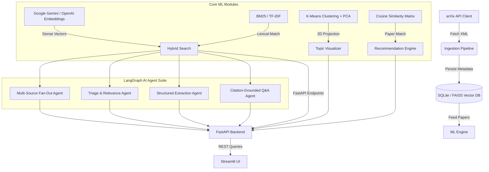

# 🌌 Research Intelligence Platform

<p align="center">
  
  
  
  
  
  
  
</p>

A production-grade **Information Retrieval & AI Automation Platform** that provides semantic search, content-based recommendation, unsupervised topic clustering, and time-series trend analysis over academic AI literature. 

Designed with a decoupled microservice architecture, the system is fully containerized, memory-optimized for cloud deployment, and powered by an advanced LangGraph AI Agent orchestration suite.

---

## 🏗️ System Architecture



---

## 🤖 LangChain & LangGraph AI Agent Suite

The platform integrates advanced autonomous agents orchestrated by a `StateGraph` state machine to ensure fault-tolerant execution. It is natively integrated with **LangChain** and supports both **Google Gemini 2.0 Flash** and **OpenAI GPT-4o-mini**.

### 1. Multi-Source Fan-Out Agent
* **Role**: Live Data Retrieval
* **Mechanism**: Concurrently searches the local FAISS index alongside live external databases (arXiv API, Semantic Scholar). It automatically deduplicates papers based on normalized titles to ensure comprehensive, real-time results.

### 2. Triage & Relevance Ranking Agent
* **Role**: Intelligent Re-Ranking
* **Mechanism**: Dynamically evaluates candidate papers on *Relevance*, *Recency*, and *Methodological Solidity*. It assigns a 1-10 score for each category, calculates a weighted composite score, and writes a natural language rationale explaining *why* the paper is useful.

### 3. Structured Extraction Agent
* **Role**: Literature Matrix Builder
* **Mechanism**: Leverages LangChain's `with_structured_output` and Pydantic schemas. It reads unstructured paper abstracts and strictly extracts the **Dataset**, **Core Method/Architecture**, **Key Results**, and **Limitations**, presenting them in a unified comparison matrix.

### 4. Citation-Grounded Q&A Agent
* **Role**: RAG (Retrieval-Augmented Generation) Chat
* **Mechanism**: A rigorous Q&A system that forces the LLM to answer user queries *strictly* based on retrieved contexts. It embeds precise inline citations `[arXiv:ID]` for every synthesized claim to completely eliminate LLM hallucination.

---

## 🔬 Core ML Concepts & Optimizations

### 1. Reciprocal Rank Fusion (RRF) Hybrid Search
Combining lexical search (keyword matching) and semantic search (dense embeddings) using basic score addition is highly prone to scale mismatches. This system implements **Reciprocal Rank Fusion (RRF)**, scoring documents based on their rank ordering in each search pass rather than raw scores.

### 2. Cloud Memory Optimization (API Embeddings)
Loading heavy PyTorch Transformer models (`SentenceTransformers`) in memory requires >2GB RAM, causing **Out-Of-Memory (OOM)** crashes on free cloud tiers. 
* **The Fix**: The ML Engine uses `langchain-google-genai` to offload vector embeddings to the **Google Gemini API** (`models/text-embedding-004`). 
* **Result**: RAM usage dropped from 2.5GB to **< 250 MB**, allowing the entire application to run flawlessly on Streamlit Community Cloud's free tier. 
* *Note: A local batch-processing rate limiter is implemented to respect free-tier API limits.*

### 3. Centroid-Based Profile Personalization
The platform provides personalized content-based recommendations by tracking a user's bookmarked reading history. It computes the **User Interest Centroid Vector** (the mean of all bookmarked paper vectors) and uses it to query the FAISS index for undiscovered papers.

### 4. Unsupervised K-Means Topic Clustering & PCA
High-dimensional embeddings (768-dim) are grouped using a **K-Means** clustering model ($K=5$) and projected down to 2 dimensions using **Principal Component Analysis (PCA)** for interactive scatter plot visualization.

---

## ⚡ Setup & Deployment Guide

### Option A: Streamlit Community Cloud (Recommended & 100% Free)
Because of our advanced memory optimizations, you can host the entire app (Frontend + Backend) securely on Streamlit Cloud for free.
1. Go to [share.streamlit.io](https://share.streamlit.io).
2. Deploy the `main` branch with Main file path: `frontend/app.py`.
3. In Advanced Settings -> Secrets, add your API key:
   ```toml
   GEMINI_API_KEY = "your_google_api_key_here"
   ```
*(The Streamlit frontend will automatically spawn the FastAPI backend internally and securely propagate your secrets!)*

### Option B: Local Native Deployment
1. **Install Dependencies**:
   ```bash
   pip install -r requirements.txt
   ```
2. **Start the Web Application**:
   ```bash
   export GEMINI_API_KEY="your_api_key"
   streamlit run frontend/app.py
   ```
*(The backend will auto-start in the background on port 8000).*

### Option C: Docker Compose (Multi-Container)
Ensure Docker is running, then run:
```bash
docker-compose up --build
```
This spins up PostgreSQL (`5432`), FastAPI (`8000`), and Streamlit (`8501`) in isolated containers.

---

## 🧪 Unit Testing Pipeline

Verify all calculations (RRF rankings, FAISS read/write serialization, K-Means clustering, and domain classifier metrics) locally:
```bash
python -m unittest tests/test_ml_pipeline.py
```
