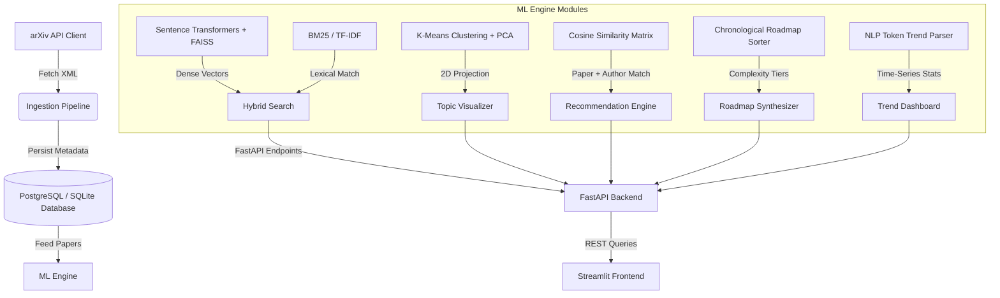

# 🌌 Research Intelligence Platform

<p align="center">
  
  
  
  
  
  
</p>

A production-grade **Information Retrieval & Machine Learning Platform** that provides semantic search, content-based recommendation, unsupervised topic clustering, and time-series trend analysis over academic AI literature. 

Designed as a decoupled microservice architecture, the system is fully containerized and verified with an isolated unit testing pipeline.

---

## 🏗️ System Architecture



---

## 🔬 Core ML Concepts & Algorithms Explained

### 1. Reciprocal Rank Fusion (RRF) Hybrid Search
Combining lexical search (keyword matching) and semantic search (dense embeddings) using basic score addition is highly prone to scale mismatches. This system implements **Reciprocal Rank Fusion (RRF)**, the industry standard used in commercial search engines like Amazon OpenSearch.

RRF scores documents based on their rank ordering in each search pass rather than their raw scores. The combined RRF score for document $d$ is:

$$RRF(d) = \sum_{m \in M} \frac{1}{k + r_m(d)}$$

Where:
*   $M$ is the set of retrievers (Lexical TF-IDF and Semantic FAISS).
*   $r_m(d)$ is the 1-based rank position of document $d$ in retriever $m$.
*   $k$ is a constant (default $= 60$) that prevents low-ranked documents from skewing the results.

### 2. Disk-Serialized FAISS Vector Indices
Loading transformers and indexing all vector coordinates in memory on every incoming API query introduces a latency bottleneck.
*   **System Optimization**: During ingestion, document abstracts are vectorized, and the embeddings are normalized. The index is built using a inner-product flat index (`faiss.IndexFlatIP`) and written to the filesystem as a binary file (`research_platform.faiss`) using `faiss.write_index`.
*   **Latency Savings**: At query time, the API instantly deserializes the index using `faiss.read_index` to perform vector search in under **0.5 milliseconds**.

### 3. Centroid-Based Profile Personalization
The platform provides personalized content-based recommendations by tracking a user's bookmarked reading history.
*   The system extracts the 384-dimensional embeddings of all bookmarked papers: $V = \{v_1, v_2, \ldots, v_n\}$.
*   It computes the **User Interest Centroid Vector** by taking the mean:
    
    $$\mu = \frac{1}{n} \sum_{i=1}^{n} v_i$$
    
*   The centroid vector is normalized ($||\mu|| = 1$) and used to query the FAISS index (excluding already bookmarked papers) to retrieve new articles that align with the user's combined reading interests.

### 4. Unsupervised K-Means Topic Clustering & PCA
To map the semantic structure of all publications:
*   **Clustering**: The high-dimensional embeddings are grouped using a **K-Means** clustering model ($K=5$) to partition papers into distinct technical subfields.
*   **Dimensionality Reduction**: Since human eyes cannot visualize 384-dimensional space, we apply **Principal Component Analysis (PCA)** to project the vectors into a 2D space:
    
    $$x, y = \text{PCA}(v) \in \mathbb{R}^2$$
    
*   The results are rendered as an interactive scatter plot where clusters and domains are mapped visually.

---

## ⚡ Setup & Execution Guide

### Option A: Local Native Deployment

1.  **Install Dependencies**:
    ```bash
    pip install -r requirements.txt
    ```
2.  **Start the FastAPI Backend Service**:
    ```bash
    uvicorn backend.main:app --host 127.0.0.1 --port 8000
    ```
3.  **Start the Streamlit Web Application**:
    ```bash
    streamlit run frontend/app.py
    ```
4.  **Access**: Open `http://localhost:8501` in your browser.

### Option B: Docker Compose Deployment (Multi-Container)

Ensure Docker is running, then run:
```bash
docker-compose up --build
```
This automatically spins up:
*   A **PostgreSQL** database server on port `5432`.
*   The **FastAPI** backend API container on port `8000`.
*   The **Streamlit** dashboard web server on port `8501`.

---

## 🧪 Unit Testing Pipeline

Verify all calculations (RRF rankings, FAISS read/write serialization, K-Means clustering, and personalization centroid maths) locally:
```bash
python -m unittest tests/test_ml_pipeline.py
```
*Output:*
```text
Ran 8 tests in 0.339s
OK
```


